# <h1></h1>

## Índice 

* [1. Descrição](#1-descrição)

* [2. Sobre o projeto](#2-sobre-o-projeto)
  
* [3. Demostrações da aplicação](#3-demonstrações-da-aplicação)
* [4. Tecnologias utilizadas](#4-tecnologias-utilizadas)
* [5. Considerações finais](#5-consideracoes-finais)

* [6. Autores](#6-autores)

***

## 1. Descrição

Projeto realizado durante o [**Bootcamp Laboratória - SAP005**]("http://laboratoria.la"), com intuito de criarmos uma página web para visualização de dados adequados às necessidades e preferências do usuário.

## 2. Sobre o projeto

Escolhemos trabalhar com os dados da série animada [Rick and Morty](https://pt.wikipedia.org/wiki/Rick_and_Morty), e foram realizadas pesquisas através de formulários para conhecer melhor seus espectadores.

### Pesquisas

De ínicio, quisemos entender a relação dos usuários com a série e seu interesse em ter acesso a informações complementares deste conteúdo:

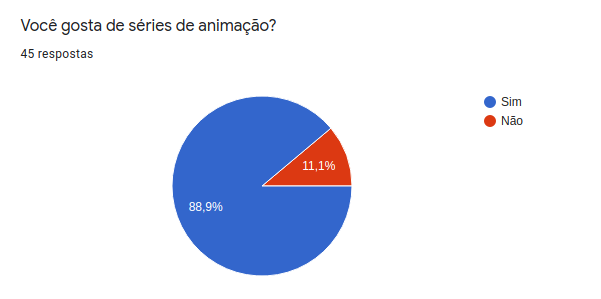

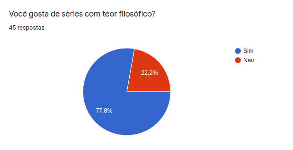

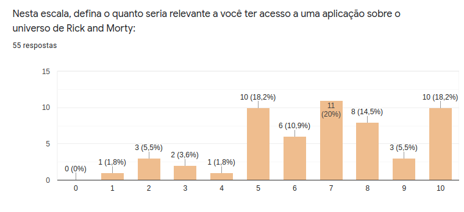

Para nos aprofundar mais neste universo, fizemos mais perguntas para determinar como seria nossa aplicação:

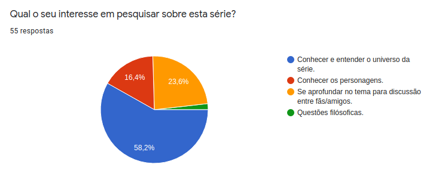

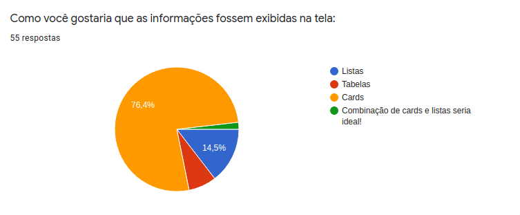

### Personas e História de Usuário

Com a pesquisa em mãos, e muitas idéias na cabeça, definimos nossas _*Personas*_ e a *História de Usuário*:

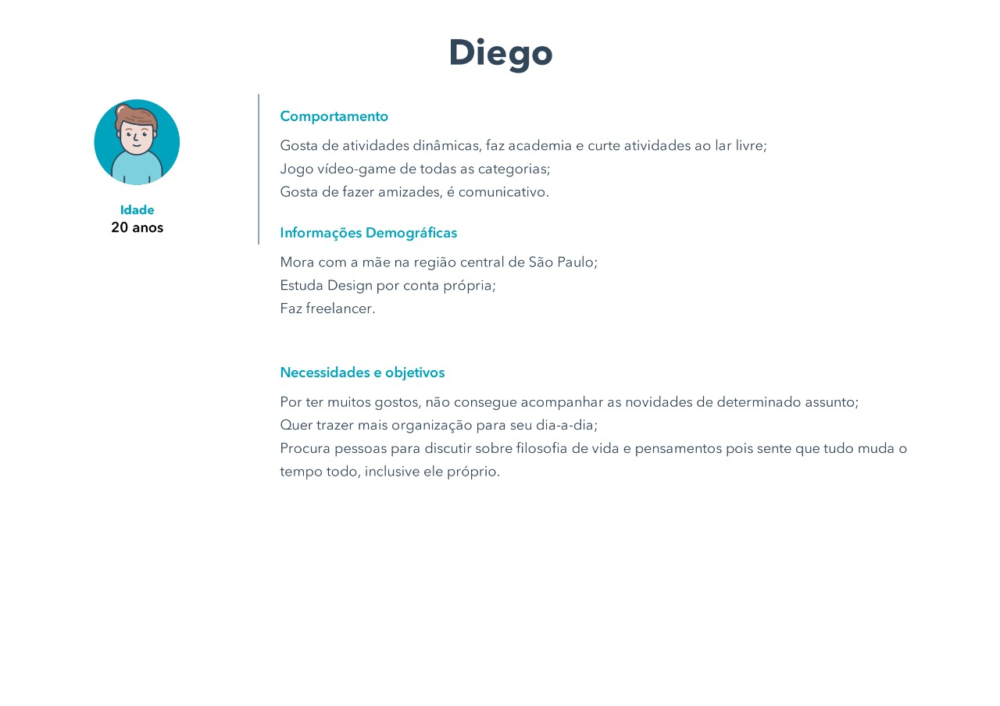

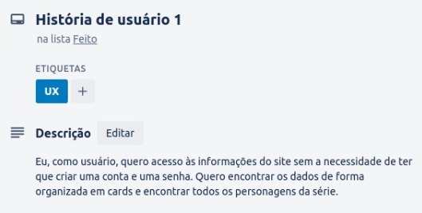

Com isto, criamos nosso prótipo, entendendo que nosso usuário gostaria de obter informações de forma simples e intuitiva.

### Protótipo de Baixa Fidelidade

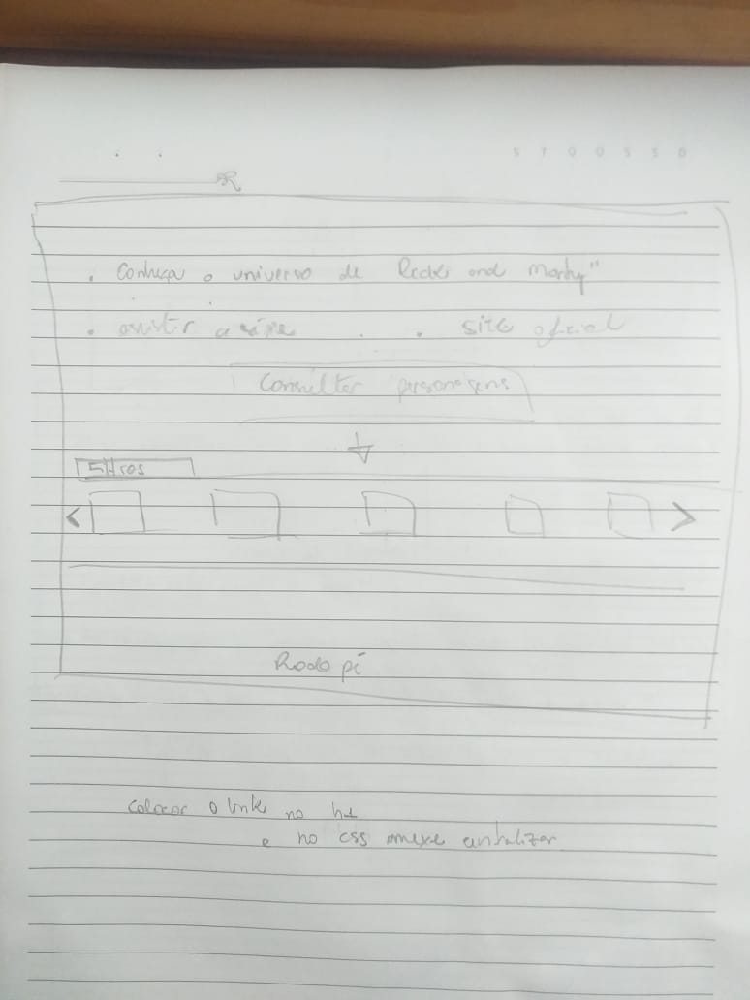

## 3. Demonstrações da aplicação

Tirando nosso protótipo do papel para a tela, utilizamos o mesmo modelo de fonte da série para o logo da nossa aplicação. Utilizamos cores para os botões que fazem referência à série. Nosso background contém os dois personagens mais relevantes, para que o usuário se sinta realmente dentro deste universo, conhecendo melhor as características de cada um dos 493 personagens.

*Versão Desktop:*

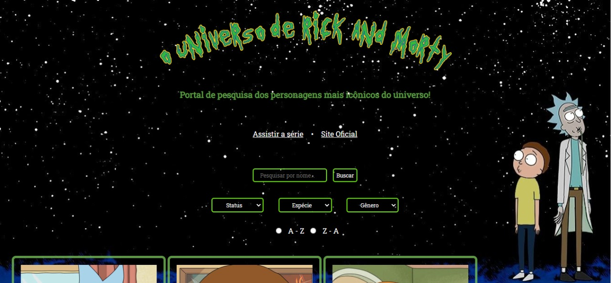

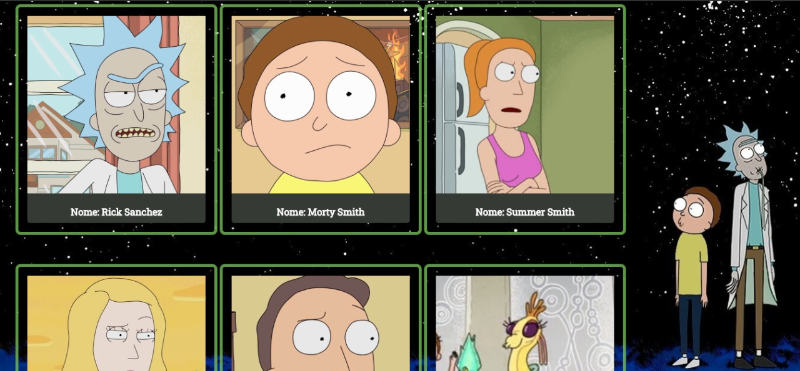

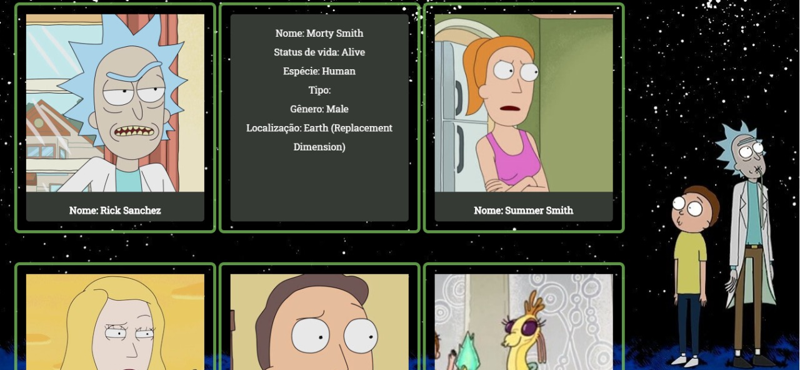

*Versão mobile:*

.

.
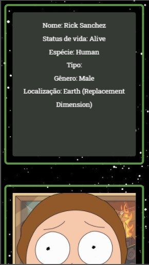

## 4. Tecnologias utilizadas

 Este projeto será foi realizado utilizando as ferramentas abaixo:
  * Vs Code;
  * Trello;
  * Google Forms;
  * HubSpot;
  * GitHub;
  * FontMeme.

## 5. Considerações Finais 

Gostaríamos de agradecer todo empenho e auxílio da equipe da Laboratória, e de nossas colegas de turma, que a todo instante compartilharam os conhecimentos e descobertas conosco, nos auxiliando a encontrar as soluções necessárias para a entrega deste projeto.

Também agradecemos imensamente aos nossos amigos e familiares que dispuseram de seu tempo para contribuir de diversas formas nas nossas pesquisas e aprendizados.

Por fim, mas não menos importante, agradecemos aos nossos demais amigos desenvolvedores pelo suporte e estímulo! :heart:

## 6. Autores

Projeto realizado por <a href="http://github.com/dunia07" target="_blank"> Dunia Ghazzaoui </a> e <a href="http://github.com/giomadeira" target="_blank"> Giovana Madeira </a>.

*“The universe is a crazy and chaotic place, Morty!”* - Sanchez,Rick.
